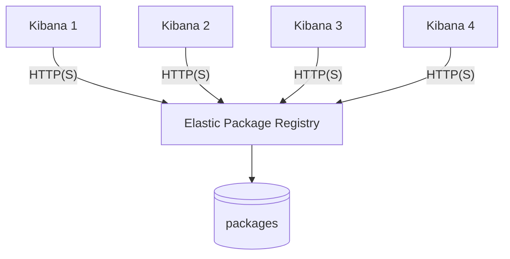

# EPR

## Table of contents

<!-- vscode-markdown-toc -->
* 1. [EPR - Elastic Package Registry](#EPR-ElasticPackageRegistry)
	* 1.1. [Overview](#Overview)
	* 1.2. [EPR Architecture](#EPRArchitecture)
	* 1.3. [EPR Installation](#EPRInstallation)
		* 1.3.1. [EPR Binary](#EPRBinary)
		* 1.3.2. [EPR Docker](#EPRDocker)
* 2. [Elastic Package Management Script](#ElasticPackageManagementScript)
	* 2.1. [Purpose](#Purpose)
	* 2.2. [Usage](#Usage)
		* 2.2.1. [1. Set Required Environment Variables](#SetRequiredEnvironmentVariables)
		* 2.2.2. [2. Run the Script](#RuntheScript)
		* 2.2.3. [3. Examples](#Examples)

<!-- vscode-markdown-toc-config
	numbering=true
	autoSave=true
	/vscode-markdown-toc-config -->
<!-- /vscode-markdown-toc -->

##  1. <a name='EPR-ElasticPackageRegistry'></a>EPR - Elastic Package Registry

###  1.1. <a name='Overview'></a>Overview

Elastic Package Registry referred as EPR, is a service designed to streamline the management and distribution of integrations packages. EPR offers both public and private repositories for package storage and hosting, providing users with a secure, reliable way to share their custom integrations and plugins with others.

EPR simplifies the process by allowing users to create, manage, and publish their own packages. These packages can be easily installed and updated within Kibana using the WebUI. This not only saves time for developers and users but also ensures consistency in deployments across various environments.

###  1.2. <a name='EPRArchitecture'></a>EPR Architecture



###  1.3. <a name='EPRInstallation'></a>EPR Installation

####  1.3.1. <a name='EPRBinary'></a>EPR Binary

**Golang**

###  2.2. <a name='Golang'></a>Golang

elastic-package is written in go and needs golang to be installed. As a matter of simplicity we will use GVM (Go Version Manger) that will allow to install and manage mutiple version of Go.

**Linux (amd64)**

```bash
# Linux Example (assumes ~/bin is in PATH).
curl -sL -o /usr/local/bin/gvm https://github.com/andrewkroh/gvm/releases/download/v0.5.2/gvm-linux-amd64
chmod +x /usr/local/bin/gvm
eval "$(gvm 1.23.2)"
go version
```

**Linux (arm64)**

```bash
# Linux Example (assumes ~/bin is in PATH).
curl -sL -o /usr/local/bin/gvm https://github.com/andrewkroh/gvm/releases/download/v0.5.2/gvm-linux-arm64
chmod +x /usr/local/bin/gvm
eval "$(gvm 1.23.2)"
go version
```

**macOS (universal)**

```bash
# macOS Example
sudo curl -sL -o /usr/local/bin/gvm https://github.com/andrewkroh/gvm/releases/download/v0.5.2/gvm-darwin-all
sudo chmod +x /usr/local/bin/gvm
eval "$(gvm 1.23.2)"
go version
```

[Reference](https://github.com/andrewkroh/gvm)

```bash
go version
```

Confirm that the command prints the installed version of Go.

**Mage**

Now that you have golang you can install Mage and its dependencies

```bash
git clone https://github.com/magefile/mage
cd mage
go run bootstrap.go
```

Validate it's installed by running the following command

```bash
mage --version
Mage Build Tool v1.15.0-5-g2385abb
Build Date: 2024-09-18T12:24:14Z
Commit: 2385abb
built with: go1.23.1
```

**Elastic Package Registry**

Now that you have all the tools installed you can clone the elastic package registry

```bash
git clone git@github.com:elastic/package-registry.git
cd package-registry
mage build
```

Binary should be in the bin folder, we are now installing onto the system by running the following commands as root user

```bash
mkdir -p /etc/package-registry /var/package-registry
mv package-registry /etc/package-registry/
```

You can validate it's installed by running the following command:

```bash
/etc/package-registry/package-registry -version
Elastic Package Registry version 1.25.1
```

Now that everything is in place, we can configure package-registry through its configuration _config.yml_ file that you can put in the _/etc/package-registry_ folder.

Below an example of the _config.yml_ file:

```bash
# If users want to add their own packages, they should be put under
# /packages/package-registry or the config must be adjusted.
package_paths:
  - /var/package-registry/packages

cache_time.index: 10s
cache_time.search: 10s
cache_time.categories: 10s
cache_time.catch_all: 10s
```

where:

* _package_paths_ : folder(s) where the packages are stored
* cache_time.index: Sets the caching time for the index endpoint (providing registry info). It allows quick updates when a new version is released, suggested at 10 seconds for fast response to registry changes.
* cache_time.search: Caches the /search endpoint, which should update each time a new package version is released. Recommended at 1 minute to limit delay in package visibility.
* cache_time.categories: Defines cache duration for category counters, which are less critical and suggested at 10 minutes. This impacts only counter accuracy during cache time.
* cache_time.catch_all: Caches all other static assets indefinitely but suggested at 1 hour to reduce CDN traffic while allowing periodic updates.

[Reference](https://github.com/elastic/package-storage/issues/390)

To ease the management of the configuration, we can use a systemd unit _/etc/systemd/system/package-registry_ file to start the service automatically on boot :

Simply paste the following content and adapt it if needed:

```bash
[Unit]
Description=Elastic Package Registry Services

[Service]
User=root
WorkingDirectory=/etc/package-registry
ExecStart=/etc/package-registry/package-registry -address 0.0.0.0:8080 -config /etc/package-registry/config.yml 
# optional items below
Restart=always
RestartSec=3

StandardOutput=syslog
StandardError=syslog
SyslogIdentifier=package-registry

[Install]
WantedBy=multi-user.target

```

Then, reload the systemd daemon and enable the service :

```bash
 systemctl daemon-reload
 systemctl enable package-registry --now
```

Your service will be available on the port 8080 of your server. You can check it with a _curl_ command to see if it is working.

```bash
curl http://localhost:8080/search\?package\={PACKAGE_NAME}\&prerelease\=true
```

####  1.3.2. <a name='EPRDocker'></a>EPR Docker

You can also use the prebuilt docker image :

```bash
docker run --rm -it -p 8080:8080 \
  -v /path/to/local/packages:/packages/package-registry \
  $(docker images -q docker.elastic.co/package-registry/package-registry:main)
```

##  2. <a name='ElasticPackageManagementScript'></a>Elastic Package Management Script

###  2.1. <a name='Purpose'></a>Purpose

This script automates the process of managing Elastic packages by:

- Searching for a package in the Elastic Package Registry (EPR) based on the package name and Kibana version.
- Downloading the package from the registry.
- Uploading the package to a specified Kibana instance using the Fleet API.

The script simplifies the workflow for administrators and developers who need to manage Elastic integrations efficiently.

###  2.2. <a name='Usage'></a>Usage

####  2.2.1. <a name='SetRequiredEnvironmentVariables'></a>1. Set Required Environment Variables

Before running the script, ensure the following environment variables are set:

```bash
export KIBANA_URL="https://your-kibana-instance:5601"
export KIBANA_API_KEY="your-kibana-api-key"
```

####  2.2.2. <a name='RuntheScript'></a>2. Run the Script

```bash
./manage_package.sh <kibana_version> <package_name> [--debug] [--insecure]
```

explanations :

- <kibana_version>: Specify the version of Kibana (e.g., 8.15.2).
- <package_name>: Name of the package to search and upload (e.g., netskope).
- --debug: Enable verbose output for debugging the search and upload process.
- --insecure: Allow insecure connections to the Kibana server (useful for self-signed certificates).

####  2.2.3. <a name='Examples'></a>3. Examples

```bash
./manage_package.sh 8.15.2 netskope --debug
```

with insecure connection:

```bash
./manage_package.sh 8.15.2 netskope --insecure
```