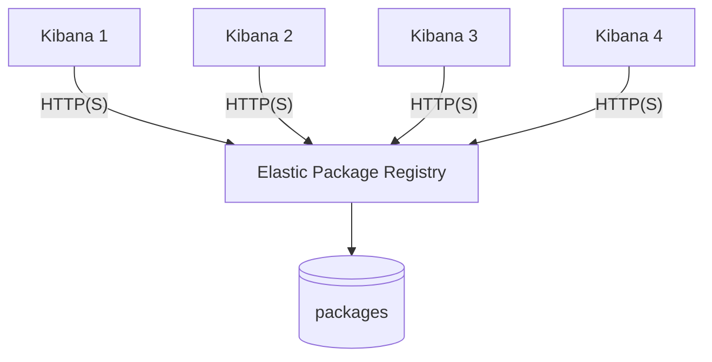

# Elastic Package Registry - Community Packages & Tools

[](https://github.com/fred-maussion/demo_epr/actions/workflows/release-monitor.yml)

## Table of Contents
1.  [About this Repository](#about-this-repository)
2.  [Disclaimer](#disclaimer)
3.  [EPR Overview](#epr-overview)
    * [Architecture](#architecture)
4.  [Installation](#installation)
    * [Using Pre-built Packages (Recommended)](#using-pre-built-packages-recommended)
    * [Building from Source](#building-from-source)
    * [Using Docker](#using-docker)
5.  [Usage](#usage)
    * [Managing the Service](#managing-the-service)
    * [Elastic Package Management Script](#elastic-package-management-script)

## About this Repository

This repository provides an automated solution for building and releasing Debian (`.deb`) and RPM (`.rpm`) packages for the [Elastic Package Registry](https://github.com/elastic/package-registry).

A GitHub Actions workflow automatically monitors the official `elastic/package-registry` for new releases. When a new release is detected, the workflow downloads the source code, builds the `package-registry` binary, and packages it along with the necessary data files, configuration, and a systemd service file. The resulting packages are then published as a new release in this repository.

## Disclaimer

**This is a community-driven project and is not officially affiliated with or supported by Elastic.** The packages provided here are built from the official open-source code but are not official Elastic distributions. For any issues with these packages, please open an issue in this repository. **Do not contact Elastic support for assistance with these packages.**

## EPR Overview

The Elastic Package Registry (EPR) is a service designed to streamline the management and distribution of integration packages. EPR offers both public and private repositories for package storage and hosting, providing users with a secure, reliable way to share their custom integrations and plugins with others.

EPR simplifies the process by allowing users to create, manage, and publish their own packages. These packages can be easily installed and updated within Kibana using the WebUI. This not only saves time for developers and users but also ensures consistency in deployments across various environments.

### Architecture



## Installation

### Using Pre-built Packages (Recommended)

You can download the latest packages directly from the [Releases Page](https://github.com/fred-maussion/demo_epr/releases). For each release, you will find `.deb` and `.rpm` files, along with their corresponding MD5 and SHA256 checksums for integrity validation.

#### Debian / Ubuntu

1.  Download the latest `.deb` package from the releases page.
2.  Install the package using `dpkg`:
    ```bash
    sudo dpkg -i elastic-package-registry_*.deb
    ```
    If you encounter any dependency issues, you can resolve them with:
    ```bash
    sudo apt-get install -f
    ```

#### RHEL / CentOS / Fedora

1.  Download the latest `.rpm` package from the releases page.
2.  Install the package using `rpm` or your system's package manager (`yum` or `dnf`):
    ```bash
    # Using rpm
    sudo rpm -ivh elastic-package-registry-*.rpm

    # Or using dnf/yum
    sudo dnf install elastic-package-registry-*.rpm
    ```

### Building from Source

For advanced users who wish to build the binary themselves.

**1. Install Golang**

We recommend using GVM (Go Version Manager) to install and manage Go versions.

* **Linux (amd64)**
    ```bash
    curl -sL -o /usr/local/bin/gvm [https://github.com/andrewkroh/gvm/releases/download/v0.5.2/gvm-linux-amd64](https://github.com/andrewkroh/gvm/releases/download/v0.5.2/gvm-linux-amd64)
    chmod +x /usr/local/bin/gvm
    eval "$(gvm 1.23.2)"
    go version
    ```
* **Linux (arm64)**
    ```bash
    curl -sL -o /usr/local/bin/gvm [https://github.com/andrewkroh/gvm/releases/download/v0.5.2/gvm-linux-arm64](https://github.com/andrewkroh/gvm/releases/download/v0.5.2/gvm-linux-arm64)
    chmod +x /usr/local/bin/gvm
    eval "$(gvm 1.23.2)"
    go version
    ```
* **macOS (universal)**
    ```bash
    sudo curl -sL -o /usr/local/bin/gvm [https://github.com/andrewkroh/gvm/releases/download/v0.5.2/gvm-darwin-all](https://github.com/andrewkroh/gvm/releases/download/v0.5.2/gvm-darwin-all)
    sudo chmod +x /usr/local/bin/gvm
    eval "$(gvm 1.23.2)"
    go version
    ```

**2. Install Mage**

With Go installed, you can now install Mage.

```bash
git clone [https://github.com/magefile/mage](https://github.com/magefile/mage)
cd mage
go run bootstrap.go
mage --version
```

**3. Build and Install Elastic Package Registry**

```bash
git clone git@github.com:elastic/package-registry.git
cd package-registry
mage build
```

The binary will be in the `bin` folder. Install it onto the system:

```bash
sudo mkdir -p /etc/package-registry /var/package-registry
sudo mv package-registry /etc/package-registry/
/etc/package-registry/package-registry --version
```

### Using Docker

You can also use the prebuilt docker image:

```bash
docker run --rm -it -p 8080:8080 \
  -v /path/to/local/packages:/packages/package-registry \
  $(docker images -q docker.elastic.co/package-registry/package-registry:main)
```

## Usage

### Managing the Service

When you install the `.deb` or `.rpm` package, the following is configured:

* **Binary:** `/usr/bin/package-registry`
* **Config File:** `/etc/package-registry/config.yml`
* **Data Directory:** `/var/package-registry/packages`
* **Service File:** `/usr/lib/systemd/system/package-registry.service`

The service is automatically enabled upon installation. You can manage it using standard `systemctl` commands:

```bash
# Start the service
sudo systemctl start package-registry.service

# Stop the service
sudo systemctl stop package-registry.service

# Check the status of the service
sudo systemctl status package-registry.service

# View logs for the service
sudo journalctl -u package-registry.service
```

### Elastic Package Management Script

This repository may also contain a script to automate managing Elastic packages.

**Purpose**
* Searches for a package in the EPR based on the package name and Kibana version.
* Downloads the package from the registry.
* Uploads the package to a specified Kibana instance using the Fleet API.

**Usage**

1.  **Set Environment Variables**
    ```bash
    export KIBANA_URL="https://your-kibana-instance:5601"
    export KIBANA_API_KEY="your-kibana-api-key"
    ```
2.  **Run the Script**
    ```bash
    ./manage_package.sh <kibana_version> <package_name> [--debug] [--insecure]
    ```
    * `<kibana_version>`: e.g., `8.15.2`
    * `<package_name>`: e.g., `netskope`
    * `--debug`: Enable verbose output.
    * `--insecure`: Allow insecure connections.
