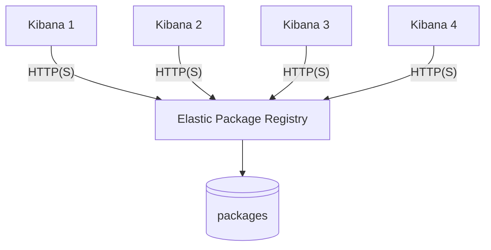

# Elastic Package Registry - Community Packages & Tools

[](https://github.com/fred-maussion/demo_epr/actions/workflows/release-monitor.yml)

## Table of Contents
1.  [About this Repository](#about-this-repository)
2.  [Disclaimer](#disclaimer)
3.  [EPR Overview](#epr-overview)
    * [Architecture](#architecture)
4.  [Installation](#installation)
    * [Using Pre-built Packages (Recommended)](#using-pre-built-packages-recommended)
    * [Building from Source](#building-from-source)
    * [Using Docker](#using-docker)
5.  [Configuration](#configuration)
    * [Method 1: Using an Environment File (Recommended)](#method-1-using-an-environment-file-recommended)
    * [Method 2: Manual Service File Edits (Advanced)](#method-2-manual-service-file-edits-advanced)
6.  [Usage](#usage)
    * [Managing the Service](#managing-the-service)
    * [Elastic Package Management Script](#elastic-package-management-script)

## About this Repository

This repository provides an automated solution for building and releasing Debian (`.deb`) and RPM (`.rpm`) packages for the [Elastic Package Registry](https://github.com/elastic/package-registry).

A GitHub Actions workflow automatically monitors the official `elastic/package-registry` for new releases. When a new release is detected, the workflow downloads the source code, builds the `package-registry` binary, and packages it along with the necessary data files, configuration, and a systemd service file. The resulting packages are then published as a new release in this repository.

## Disclaimer

**This is a community-driven project and is not officially affiliated with or supported by Elastic.** The packages provided here are built from the official open-source code but are not official Elastic distributions. For any issues with these packages, please open an issue in this repository. **Do not contact Elastic support for assistance with these packages.**

## EPR Overview

The Elastic Package Registry (EPR) is a service designed to streamline the management and distribution of integration packages. EPR offers both public and private repositories for package storage and hosting, providing users with a secure, reliable way to share their custom integrations and plugins with others.

EPR simplifies the process by allowing users to create, manage, and publish their own packages. These packages can be easily installed and updated within Kibana using the WebUI. This not only saves time for developers and users but also ensures consistency in deployments across various environments.

### Architecture



## Installation

### Using Pre-built Packages (Recommended)

You can download the latest packages directly from the [Releases Page](https://github.com/fred-maussion/demo_epr/releases). For each release, you will find `.deb` and `.rpm` files, along with their corresponding MD5 and SHA256 checksums for integrity validation.

#### Debian / Ubuntu

1.  Download the latest `.deb` package from the releases page.
2.  Install the package using `dpkg`:
    ```bash
    sudo dpkg -i elastic-package-registry_*.deb
    ```
    If you encounter any dependency issues, you can resolve them with:
    ```bash
    sudo apt-get install -f
    ```

#### RHEL / CentOS / Fedora

1.  Download the latest `.rpm` package from the releases page.
2.  Install the package using `rpm` or your system's package manager (`yum` or `dnf`):
    ```bash
    # Using rpm
    sudo rpm -ivh elastic-package-registry-*.rpm

    # Or using dnf/yum
    sudo dnf install elastic-package-registry-*.rpm
    ```

### Building from Source

For advanced users who wish to build the binary themselves.

**1. Install Golang**

We recommend using GVM (Go Version Manager) to install and manage Go versions.

* **Linux (amd64)**
    ```bash
    curl -sL -o /usr/local/bin/gvm https://github.com/andrewkroh/gvm/releases/download/v0.6.0/gvm-linux-amd64
    chmod +x /usr/local/bin/gvm
    eval "$(gvm 1.24)"
    go version
    ```
* **Linux (arm64)**
    ```bash
    curl -sL -o /usr/local/bin/gvm https://github.com/andrewkroh/gvm/releases/download/v0.6.0/gvm-linux-arm64
    chmod +x /usr/local/bin/gvm
    eval "$(gvm 1.24)"
    go version
    ```
* **macOS (universal)**
    ```bash
    sudo curl -sL -o /usr/local/bin/gvm https://github.com/andrewkroh/gvm/releases/download/v0.6.0/gvm-darwin-all
    sudo chmod +x /usr/local/bin/gvm
    eval "$(gvm 1.24)"
    go version
    ```

**2. Install Mage**

With Go installed, you can now install Mage.

```bash
git clone https://github.com/magefile/mage
cd mage
go run bootstrap.go
mage --version
```

**3. Build and Install Elastic Package Registry**

```bash
git clone git@github.com:elastic/package-registry.git
cd package-registry
mage build
```

The binary will be in the `bin` folder. Install it onto the system:

```bash
sudo mkdir -p /etc/package-registry /var/package-registry
sudo mv package-registry /etc/package-registry/
/etc/package-registry/package-registry --version
```

### Using Docker

You can also use the prebuilt docker image:

```bash
docker run --rm -it -p 8080:8080 \
  -v /path/to/local/packages:/packages/package-registry \
  $(docker images -q docker.elastic.co/package-registry/package-registry:main)
```

## Configuration

### Method 1: Using the Environment File (Recommended)

This is the best practice for managing configurations as it separates your settings from the main service file, preventing them from being overwritten during package upgrades.

#### Modify the Configuration File Template

Modify the _package-registry-env.conf_ file to hold your custom settings.

```bash
sudo vim /etc/package-registry/package-registry-env.conf
```

Paste the desired configurations into this file. You only need to include the variables you want to use. Below is a complete example with all available options:

```ini
# --- Metrics Configuration ---
# Address to expose Prometheus metrics on. Uncomment to enable.
# EPR_METRICS_ADDRESS=0.0.0.0:9000

# --- Proxy Mode Configuration ---
# Set to true to enable proxy mode.
# EPR_FEATURE_PROXY_MODE=true
# The upstream EPR instance to proxy requests to.
# EPR_PROXY_TO=[https://epr.elastic.co](https://epr.elastic.co)

# --- APM Tracing Configuration ---
# Sets the service name that appears in the APM UI.
# ELASTIC_APM_SERVICE_NAME="Elastic Package Integration"
# Defines the environment (e.g., production, staging) for filtering in the APM UI.
# ELASTIC_APM_ENVIRONMENT="production"
# Explicitly enables or disables APM instrumentation.
# ELASTIC_APM_ACTIVE="true"
# Address of the APM Server. Instrumentation is disabled if this is not set.
# ELASTIC_APM_SERVER_URL=https://your-apm-server:8200
# API key to use to authenticate with the APM Server, if needed.
# ELASTIC_APM_API_KEY=YourApiKey
# Secret token for authentication, if configured on the APM Server.
# ELASTIC_APM_SECRET_TOKEN=YourSecretToken
# Sample rate for transaction collection (0.0 to 1.0). Default is 1.0 (all transactions).
# ELASTIC_APM_TRANSACTION_SAMPLE_RATE=1.0
```

### Method 2: Manual Service File Edits (Advanced)

This method involves directly editing the service file. It is less flexible and your changes may be overwritten by package upgrades. Use this method for quick tests or if you prefer not to use an environment file.

1.  Open the full service file for editing:
    ```bash
    sudo systemctl edit --full package-registry.service
    ```

2.  Modify the `ExecStart` line to add the flags you need. Below are examples for each feature.

    * **To Enable Metrics:**
        ```ini
        ExecStart=/usr/bin/package-registry -address 0.0.0.0:8080 -metrics-address 0.0.0.0:9000 -config /etc/package-registry/config.yml
        ```

    * **To Enable Proxy Mode:**
        ```ini
        ExecStart=/usr/bin/package-registry -address 0.0.0.0:8080 --feature-proxy-mode=true -proxy-to=[https://epr.elastic.co](https://epr.elastic.co) -config /etc/package-registry/config.yml
        ```

    * **To Enable APM Tracing:** Add `Environment` lines directly under the `[Service]` section.
        ```ini
        [Service]
        Environment="ELASTIC_APM_ACTIVE=true"
        Environment="ELASTIC_APM_SERVER_URL=https://your-apm-server:8200"
        # ... add other APM variables here ...
        ExecStart=/usr/bin/package-registry -address 0.0.0.0:8080 -config /etc/package-registry/config.yml
        ```

3.  Save the file, then reload the systemd daemon and restart the service:
    ```bash
    sudo systemctl daemon-reload
    sudo systemctl restart package-registry.service
    ```

### Enabling Metrics

This configuration is for installations using the pre-built `.deb` or `.rpm` packages. To enable the Prometheus metrics endpoint, you need to edit the systemd service file. This configuration is mandatory to the usage of the official [Elastic Package Registry Integration](https://www.elastic.co/docs/reference/integrations/elastic_package_registry)

1.  Open the service file for editing:
    ```bash
    sudo systemctl edit --full package-registry.service
    ```

2.  Find the `ExecStart` line and add the `-metrics-address` flag to expose the metrics on a different port (e.g., 9000).

    **Before:**
    ```ini
    ExecStart=/usr/local/bin/package-registry -address 0.0.0.0:8080 -config /etc/package-registry/config.yml
    ```

    **After:**
    ```ini
    ExecStart=/usr/local/bin/package-registry -address 0.0.0.0:8080 -metrics-address 0.0.0.0:9000 -config /etc/package-registry/config.yml
    ```

3.  Save the file, then reload the systemd daemon and restart the service to apply the changes:
    ```bash
    sudo systemctl daemon-reload
    sudo systemctl restart package-registry.service
    ```
    The metrics will now be available at `http://<your-server-ip>:9000/metrics`.

### Enabling Proxy Mode

Proxy mode allows `elastic-package-registry` to act as a cache or proxy for another EPR instance, such as the official one at `epr.elastic.co`. This is useful for air-gapped environments or for reducing external traffic.

1.  Open the service file for editing:
    ```bash
    sudo systemctl edit --full package-registry.service
    ```
2.  Find the `ExecStart` line and add the `--feature-proxy-mode=true` and `-proxy-to` flags.

    **Before:**
    ```ini
    ExecStart=/usr/local/bin/package-registry -address 0.0.0.0:8080 -config /etc/package-registry/config.yml
    ```

    **After (Proxying to the official Elastic EPR):**
    ```ini
    ExecStart=/usr/local/bin/package-registry -address 0.0.0.0:8080 --feature-proxy-mode=true -proxy-to=https://epr.elastic.co -config /etc/package-registry/config.yml
    ```
    *You can also combine this with the metrics flag.*

3.  Save the file, then reload the systemd daemon and restart the service:
    ```bash
    sudo systemctl daemon-reload
    sudo systemctl restart package-registry.service
    ```

### Enabling APM Tracing

To monitor the performance of the `elastic-package-registry` service with Elastic APM, you can configure it using environment variables. The recommended way to do this is to place them in a dedicated file that the systemd service will load.

1.  Create and edit a new environment file:
    ```bash
    sudo vim /etc/package-registry/apm.conf
    ```

2.  Add your APM server details to this file. Here is an example:
    ```ini
    # Sets the service name that appears in the APM UI.
    ELASTIC_APM_SERVICE_NAME="Elastic Package Integration"

    # Defines the environment (e.g., production, staging) for filtering in the APM UI.
    ELASTIC_APM_ENVIRONMENT="production"

    # Explicitly enables or disables APM instrumentation.
    ELASTIC_APM_ACTIVE="true"

    # Address of the APM Server. Instrumentation is disabled if this is not set.
    ELASTIC_APM_SERVER_URL=https://your-apm-server:8200

    # Secret token for authentication, if configured on the APM Server.
    ELASTIC_APM_SECRET_TOKEN=YourSecretToken

    # Sample rate for transaction collection (0.0 to 1.0). Default is 1.0 (all transactions).
    ELASTIC_APM_TRANSACTION_SAMPLE_RATE=1.0
    ```

3.  Next, tell the systemd service to load this file. The best practice is to create a service override file.
    ```bash
    sudo systemctl edit package-registry.service
    ```
    This will open a blank file. Add the following content to it. The `-` before the path tells systemd not to error if the file is missing.
    ```ini
    [Service]
    EnvironmentFile=-/etc/package-registry/apm.conf
    ```

4.  Save the file, then reload the systemd daemon and restart the service to apply the changes:
    ```bash
    sudo systemctl daemon-reload
    sudo systemctl restart package-registry.service
    ```
    The service will now start sending tracing data to your APM server.

## Usage

### Managing the Service

When you install the `.deb` or `.rpm` package, the following is configured:

* **Binary:** `/usr/local/bin/package-registry`
* **Config File:** `/etc/package-registry/config.yml`
* **Data Directory:** `/var/package-registry/packages`
* **Service File:** `/usr/lib/systemd/system/package-registry.service`

The service is automatically enabled upon installation. You can manage it using standard `systemctl` commands:

```bash
# Start the service
sudo systemctl start package-registry.service

# Stop the service
sudo systemctl stop package-registry.service

# Check the status of the service
sudo systemctl status package-registry.service

# View logs for the service
sudo journalctl -u package-registry.service
```

### Elastic Package Management Script

This repository may also contain a script to automate managing Elastic packages.

**Purpose**
* Searches for a package in the EPR based on the package name and Kibana version.
* Downloads the package from the registry.
* Uploads the package to a specified Kibana instance using the Fleet API.

**Usage**

1.  **Set Environment Variables**
    ```bash
    export KIBANA_URL="https://your-kibana-instance:5601"
    export KIBANA_API_KEY="your-kibana-api-key"
    ```
2.  **Run the Script**
    ```bash
    ./manage_package.sh <kibana_version> <package_name> [--debug] [--insecure]
    ```
    * `<kibana_version>`: e.g., `8.15.2`
    * `<package_name>`: e.g., `netskope`
    * `--debug`: Enable verbose output.
    * `--insecure`: Allow insecure connections.
